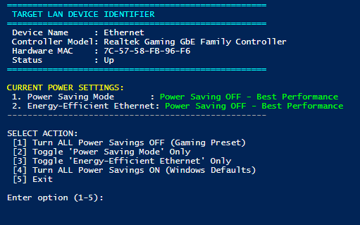

# Toggle LAN Power Saving

A lightweight, automated PowerShell utility designed to detect active physical Ethernet adapters on Windows and quickly manage hardware-level power-saving features like **Power Saving Mode** and **Energy-Efficient Ethernet (EEE)**.



## Overview

Modern Ethernet network adapters often ship with aggressive power-saving features enabled by default. While these settings conserve small amounts of energy, they frequently cause micro-stutters, increased latency, packet loss, or temporary connection drops during gaming, live streaming, or heavy network transfers.

This script provides an interactive CLI dashboard that automatically queries your physical network controller, displays its live settings upon launch, and allows 1-click toggling or preset switching.

---

## Features

- **Automatic Adapter Detection**: Identifies physical 802.3 wired Ethernet controllers (skipping virtual adapters, VPNs, and Wi-Fi).
- **Live State Inspection**: Instantly reads and reports current hardware power saving settings on startup.
- **Auto-Elevating**: Requests Administrator privileges automatically via User Account Control (UAC).
- **Preset Shortcuts**:
  - **Gaming Preset**: Disables all adapter power savings for maximum latency stability and performance.
  - **Windows Defaults**: Restores default power-saving states across all supported parameters.
- **Granular Control**: Toggle individual power settings independently.

---

## Requirements

- **Operating System**: Windows 10 or Windows 11 (64-bit)
- **Privileges**: Administrator permissions (handled automatically by script prompt)
- **PowerShell**: PowerShell 5.1+ (default in modern Windows)

---

## Installation & Usage

1. Download or clone this repository to your local machine:
   ```cmd
   git clone https://github.com/your-username/ToggleLANPowerSaving.git
   ```
2. Navigate to the folder containing `ToggleLANPowerSaving.ps1`.
3. Right-click `ToggleLANPowerSaving.ps1` and select **Run with PowerShell** (or launch from an elevated PowerShell console):
   ```powershell
   .\ToggleLANPowerSaving.ps1
   ```
4. Select an option from the menu:
   - `[1]` **Turn ALL Power Savings OFF (Gaming Preset)**
   - `[2]` **Toggle 'Power Saving Mode' Only**
   - `[3]` **Toggle 'Energy-Efficient Ethernet' Only**
   - `[4]` **Turn ALL Power Savings ON (Windows Defaults)**
   - `[5]` **Exit**

---

## License

This project is licensed under the MIT License - see the [LICENSE](LICENSE) file for details.